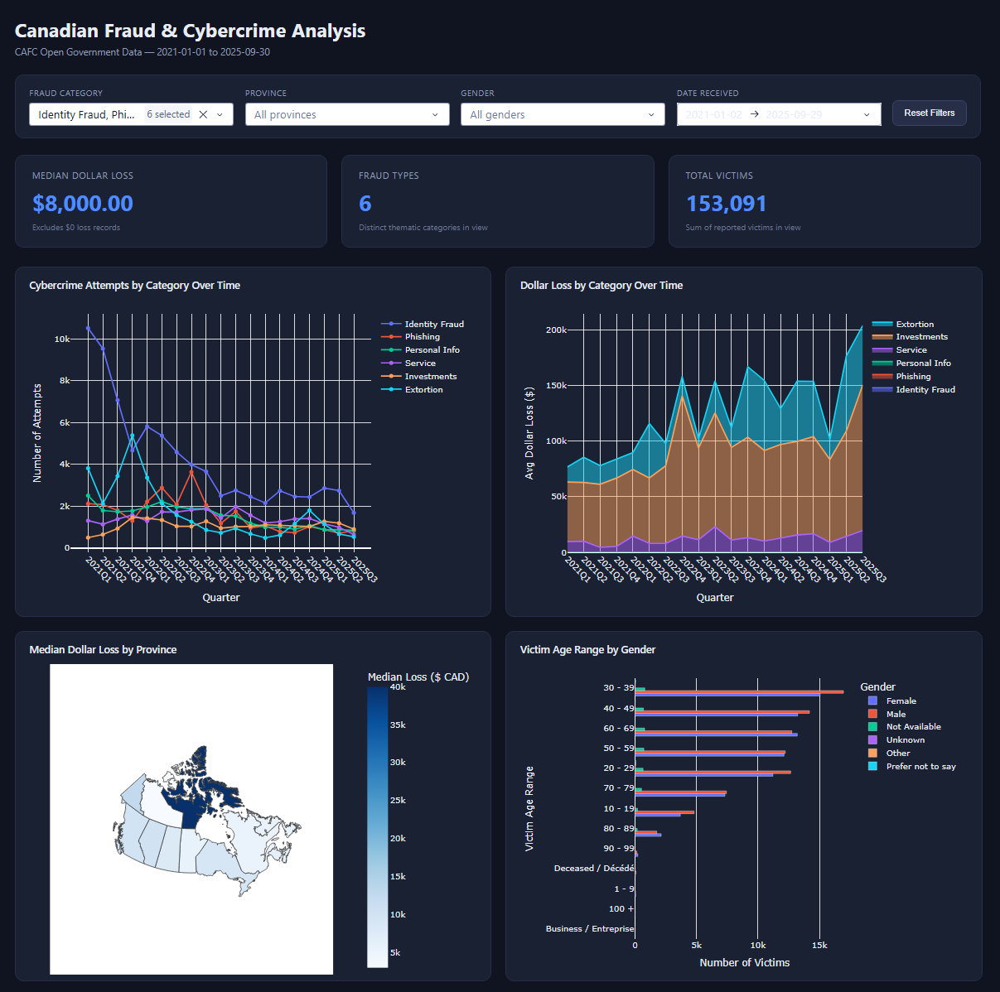

# Canadian Fraud & Cybercrime Analysis

This project analyzes Canadian fraud and cybercrime reporting data to uncover patterns, trends, and insights related to reported fraud incidents and financial losses. The analysis explores how fraud varies across categories, geography, and victim demographics, and includes an interactive dashboard for exploring the data first-hand.



## Objectives

* Explore trends and patterns in reported fraud and cybercrime cases in Canada.
* Analyze fraud reports across different categories, provinces, and demographic groups.
* Examine reported financial losses and identify categories/regions with higher impact.
* Clean, transform, and prepare the dataset for analysis.
* Build visualizations and an interactive dashboard to make fraud trends easier to explore.
* Develop data-driven insights that could support fraud awareness and prevention efforts.

## Data Source

The dataset is the **Canadian Anti-Fraud Centre (CAFC) Open Government database**, covering fraud and cybercrime reports received from **2021-01-01 to 2025-09-30**. Fields used in the analysis include:

* Date received
* Complaint received type & complaint type (Victim / Attempt)
* Country & province/state
* Fraud and cybercrime thematic category
* Solicitation method
* Gender & victim age range
* Language of correspondence
* Number of victims
* Dollar loss

## Repository Structure

```
├── analysis.ipynb          # Data cleaning + exploratory data analysis
├── dashboard.py             # Interactive Dash web dashboard
├── dashboard.png             # Dashboard screenshot
├── assets/
│   └── style.css             # Dashboard styling
├── cafc-open-gouv-database-*.csv   # Source dataset
├── requirements.txt         # Python dependencies
└── README.md
```

## Tools & Technologies

* **Python**
* **Pandas / NumPy** – data cleaning, transformation, and analysis
* **Matplotlib / Seaborn** – static exploratory visualizations
* **Plotly / Dash** – interactive dashboard and charts
* **Jupyter Notebook** – analysis and documentation

## Data Analysis Process

1. **Data Collection** – Load the CAFC fraud and cybercrime dataset.
2. **Data Cleaning** – Rename columns, fix data types (dates, currency), check for nulls and duplicates, normalize inconsistent country/province naming, and correct mis-tagged records.
3. **Data Transformation** – Derive quarterly time periods and grouped summaries for trend analysis.
4. **Exploratory Data Analysis** – Investigate distributions, top fraud categories, and relationships between category, geography, and financial loss.
5. **Data Visualization** – Build static charts (bar, line, pie, stacked area) to communicate trends.
6. **Interactive Dashboard** – Build a filterable Dash web app so KPIs and charts can be explored dynamically.
7. **Insight Generation** – Identify meaningful patterns from the analysis.

## Interactive Dashboard

`dashboard.py` runs a Dash web app with:

* **KPIs**: median dollar loss (excluding $0 records), number of distinct fraud types, and total victims.
* **A shared filter bar** — fraud category, province, gender, and date range — that cross-filters every KPI and chart from a single filtered dataset.
* **Four charts**:
  * Cybercrime attempts by category over time
  * Stacked area chart of dollar loss by category over time
  * Choropleth map of median dollar loss by Canadian province
  * Horizontal count plot of victim age range by gender

### Running the dashboard locally

```bash
pip install -r requirements.txt
python dashboard.py
```

Then open `http://127.0.0.1:8050` in a browser. An internet connection is needed on first load so the province map can fetch its Canada GeoJSON boundaries.

## Key Analysis Areas

* **Fraud Trends** – Reported fraud activity across quarters (2021–2025) and by category.
* **Victim Demographics** – Reported cases by victim age range and gender.
* **Financial Impact** – Dollar losses by fraud category, province, and complaint type.
* **Fraud Categories** – Comparison of categories by reporting volume and median/average dollar loss.
* **Geographic Distribution** – Fraud counts and losses by country and Canadian province.
* **Complaint & Solicitation Patterns** – Differences between "Victim" and "Attempt" complaints, and the solicitation methods used to reach victims.

## Key Insights

* Across all reports, the median dollar loss (excluding $0 records) is **$1,500**, spanning **39 distinct fraud categories**.
* **Romance fraud** carries one of the highest median dollar losses among top categories, well above the overall median.
* **Ontario** accounts for the largest share of Canadian reports and a higher-than-average median dollar loss.
* Victims most frequently fall in the **30–39** and **60–69** age ranges, with losses and volumes varying notably by gender within each range.
